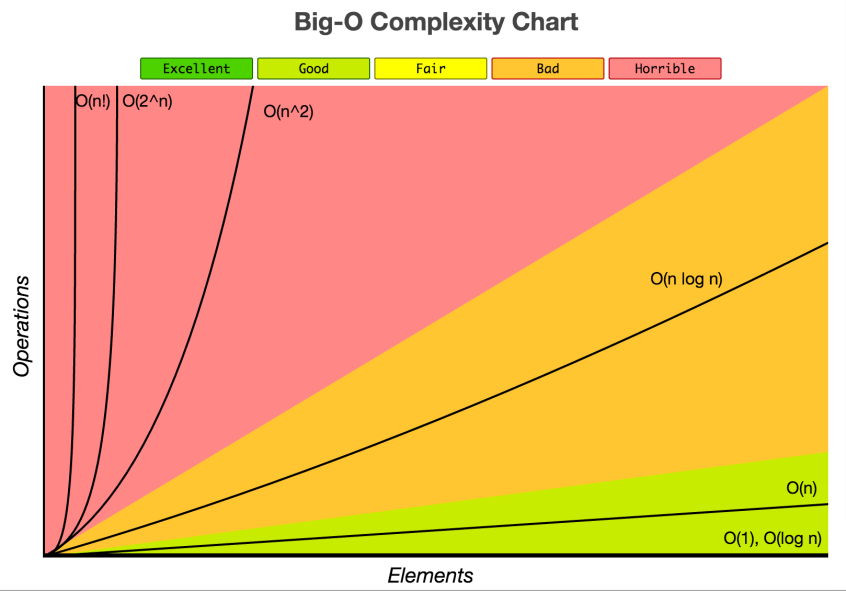

# Big O Notation

## ${O(log(n))}$

* **Logarithmic time**
* The time of execution is proportional to the logarithm of the input size.

```js
function log(n) {
    for (let i = 1; i < n; i*=2) {
        const result = i;
        console.log(result);  
    }
}
```

<div style="width: 100%; text-align: center;">
    
</div>
