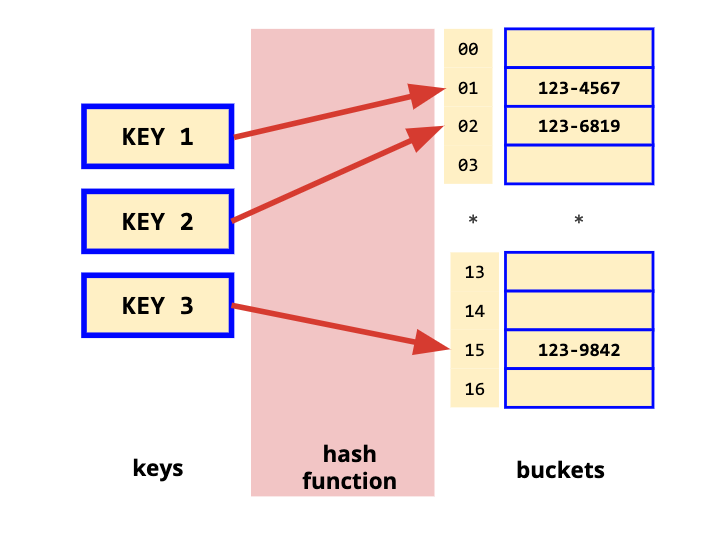

# Data Structures

## Hash Maps

* `key-value` pairs
* The main advantage of Hash Maps over other table data structures is **speed**.
* If the set of `key-value` pairs is **fixed** and **known** ahead of time (so insertions and deletions are not allowed), one may reduce the average lookup cost by a careful choice of the hash function, bucket table size, and internal data structures

    

