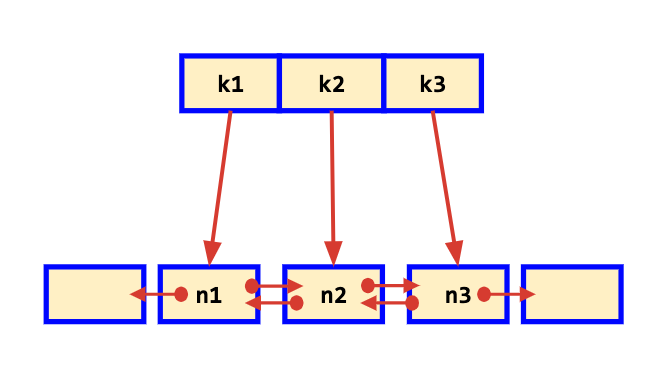

# Combining Data Structures

## LRU Cache

* Least Recently Used Cache
* Must have a **fixed size**, it needs to have some bounds to limit memory usages.
* A cache should have efficient algorithm to evict the entry when memory is full.

* **HashMap:** Cache "Insert" and "Lookup" operation should be fast, preferably O(1) time
* **Doubly Linked List:** Mechanism of tracking which entry has been queried recently and which hasn’t

    

