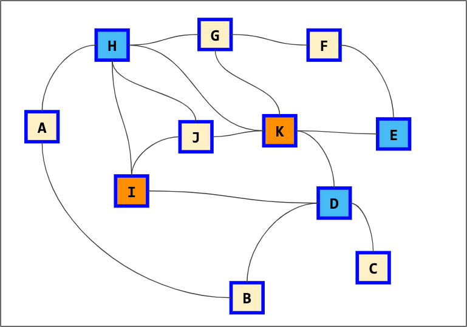

# Welsh-Powell Algorithm

    <table>
            <tr>
                <th>Vertex</th>
                <th>Valence</th>
            </tr>
            <tr>
                <td>H</td>
                <td>5</td>
            </tr>
            <tr>
                <td>K</td>
                <td>5</td>
            </tr>
            <tr>
                <td>D</td>
                <td>4</td>
            </tr>
            <tr>
                <td>I</td>
                <td>3</td>
            </tr>
            <tr>
                <td>J</td>
                <td>3</td>
            </tr>
            <tr>
                <td>G</td>
                <td>3</td>
            </tr>
            <tr>
                <td>A</td>
                <td>2</td>
            </tr>
            <tr>
                <td>B</td>
                <td>2</td>
            </tr>
            <tr>
                <td>E</td>
                <td>2</td>
            </tr>
            <tr>
                <td>F</td>
                <td>2</td>
            </tr>
            <tr>
                <td>C</td>
                <td>1</td>
            </tr>
        </tbody>
    </table>
    

