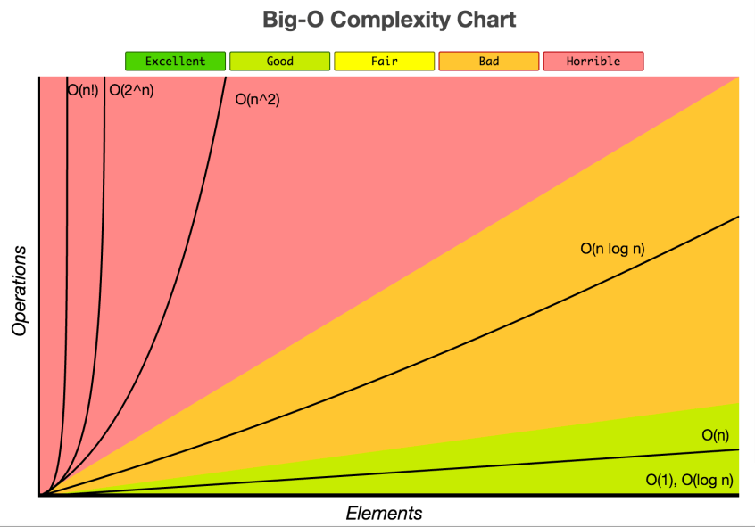

# Concepts

## Big O Notation

* Used in Computer Science to describe the performance or complexity of algorithms and classify them.
* The “O “in Big O stands for “order of”.
* Refers to the rate at which the function is growing.
* Describes different scenarios`*`

