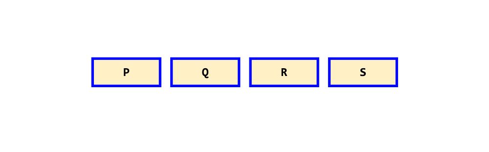
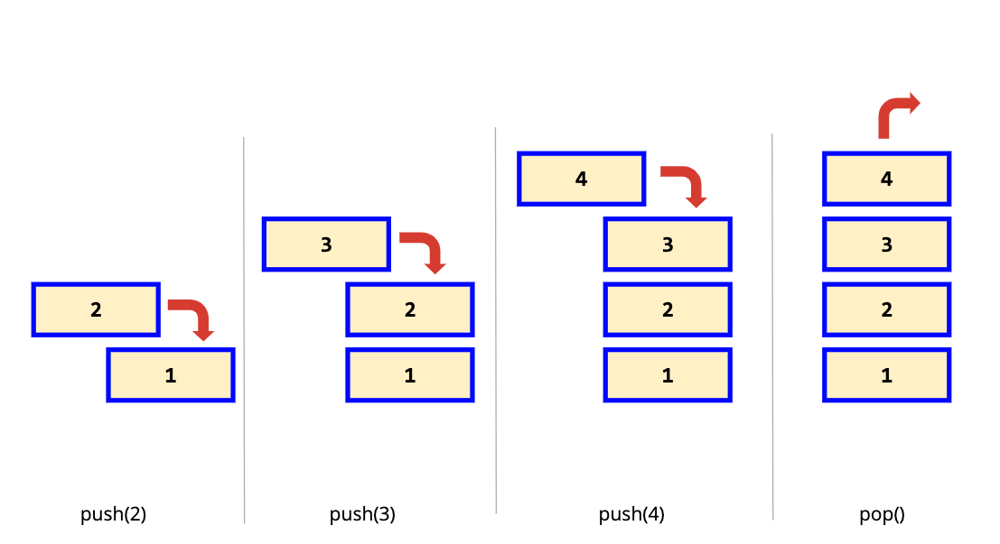
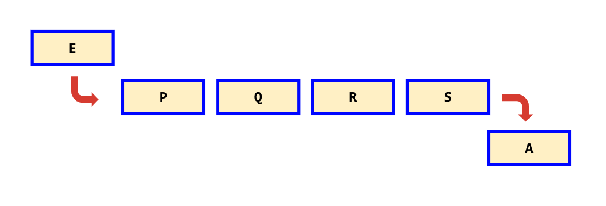

# Data Structures

## Arrays

- Arrays are stored in contiguous memory locations
- Unlike most languages where array is a reference to the multiple variable, in JavaScript array is a single variable that stores multiple elements

Array 🎞️

    

        
    

Stack 📚

    

        
    

Queue 📥📤

    

        
    

