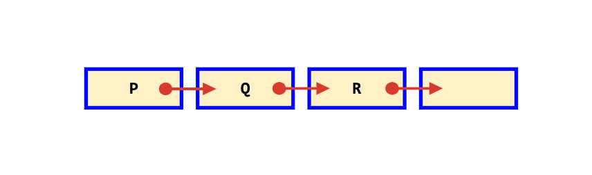

# Data Structures

## Linked Lists

Linked List 🔗

    

        
    

- They don’t need to store their items in contiguous memory blocks.
- Therefore, do not allow for random access in constant time.
- 👍 **Insertion** in the middle: O(1) for list, O(n) for array, which is good whenever there are an unknown number of elements at run-time.
- 👍 **Unshift** on a JavaScript Array is very slow
- 👎 **Push** on a JavaScript Array run considerably faster than Linked Lists

Double Linked List ⛓️

    

        
    

- The first (head) and last (tail) nodes of a doubly linked list are immediately accessible
- Allow traversal of the list from the beginning or end of the list
