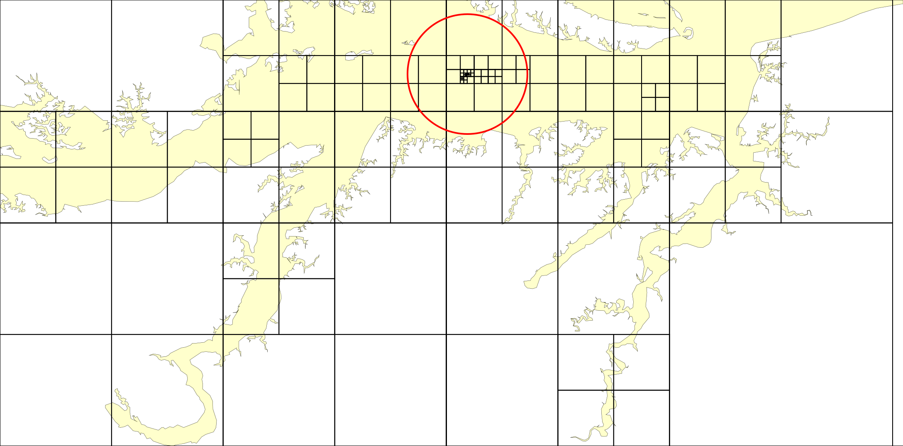
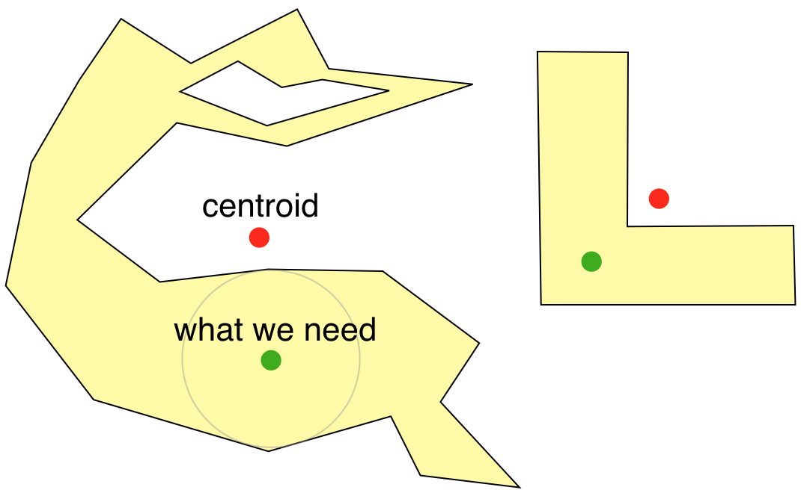

# Example: polylabel algorithm

* [Mapbox Polylabel JS Library](https://github.com/mapbox/polylabel)
* [Mapbox Polylabel Blog Post](https://blog.mapbox.com/a-new-algorithm-for-finding-a-visual-center-of-a-polygon-7c77e6492fbc?gi=4f2fd9a22974) by [Vladimir Agafonkin](https://twitter.com/mourner)

> A fast algorithm for finding polygon pole of inaccessibility, the most distant internal point from the polygon outline, implemented as a JavaScript library. Useful for optimal placement of a text label on a polygon.

    

    

