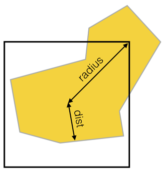

# Example: polylabel algorithm

* The polygon area is divided in cells
* Recursively subdivide them into four smaller cells, probing cell centers as candidates and discarding cells that can’t possibly contain a solution better than the one we already found
* Manage cells in a **Priority Queue**, sorted by the cell “potential”: dist + radius
* Cells are processed in the order of their potential
* **This roughly doubled the performance than doing search iterating from bigger cells to smaller ones**

    

