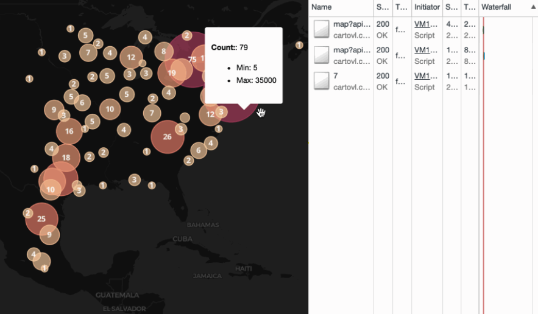

# Combining Data Structures

## LRU Cache: Example

<div style="width: 100%; text-align: center;">
    
</div>

```js
import * as LRU from 'lru-cache';

export default class ClusterCache {
	constructor (source) {
			const lruOptions = {
					max: 256,
					length: () => 1,
					maxAge: 1000 * 60 * 60
			};

			this._cache = LRU(lruOptions);
	}

	// ..
}
```
