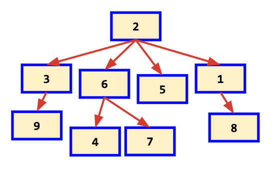

# Data Structures

## Trees

* Simulates a **hierarchical** tree structure, with a root value and subtrees of children with a parent node, represented as a set of linked nodes.

* Each node is a data structure consisting of a **value**, together with a **list of references to nodes** (the "children"), with the constraints that **no reference is duplicated**, and **none points to the root**.

    

