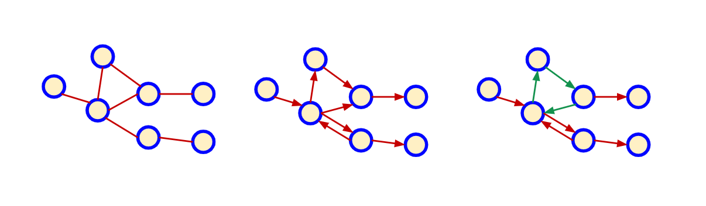

# Data Structures

## Graphs

* A Graph is a non-linear data structure consisting of nodes and edges.
* The nodes are sometimes also referred to as vertices and the edges are lines or arcs that connect any two nodes in the graph

    

